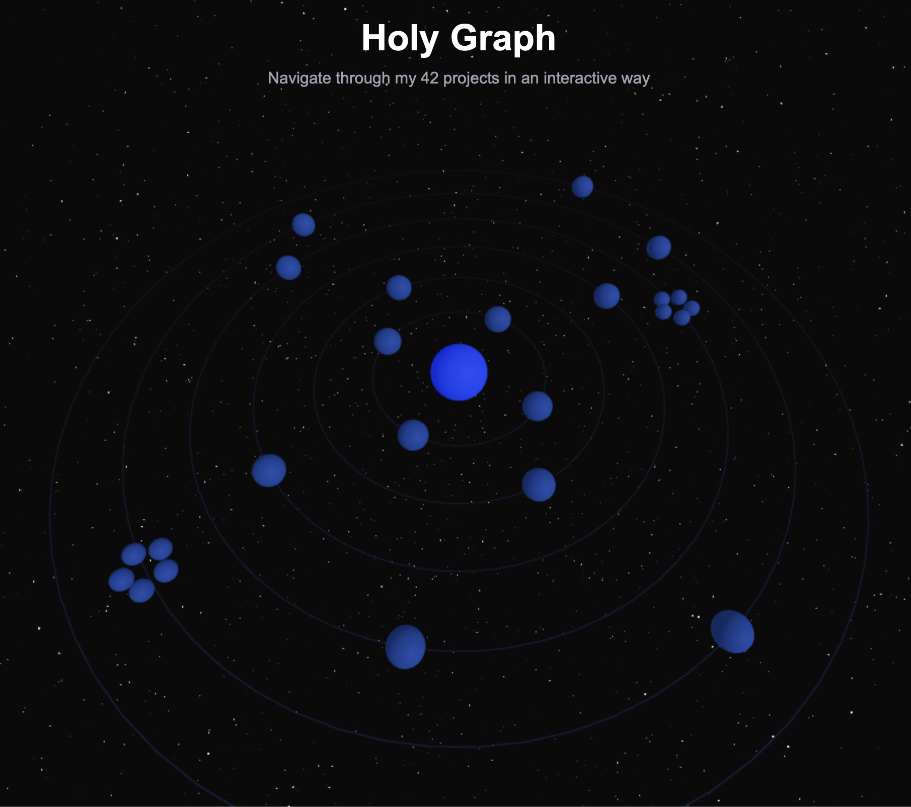

# 42-Core
> All the projects from my 42 Core curriculum

## Overview

This repository contains all the projects I completed during my journey through the 42 Core Curriculum. Each project is included as a git submodule organized by Circle (curriculum level).

The 42 program is a peer-to-peer, project-based learning environment that develops technical skills, problem-solving abilities, and collaboration through immersive projects of increasing complexity.

## Curriculum Structure

The 42 curriculum is organized in a circular structure, where each "Circle" represents a level of complexity in the learning path:

<p align="center">
  
</p>

### Circle 00 - Fundamentals
The journey begins with C programming fundamentals, building a custom library of functions and establishing core programming concepts.

### Circle 01 - Unix Logic
This level focuses on deepening C programming skills, introducing file manipulation, string operations, and memory management.

### Circle 02 - Graphical Programming & Algorithms
Introduction to graphical programming, fractals, and algorithmic sorting challenges.

### Circle 03 - First Team Projects
Implementation of multi-threading concepts and building a Unix shell.

### Circle 04 - Computer Graphics & Networking
3D rendering fundamentals, network configuration, and advanced C++ programming.

### Circle 05 - System Administration & C++
Web server development, containerization with Docker, and more advanced C++ modules.

### Circle 06 - Final Project
The culmination of the core curriculum with a full stack web project implementing modern web technologies.

## Projects By Circle

### Circle 00
- [libft](https://github.com/Melis-Pablo/libft) - A personal C library with recoded standard functions

### Circle 01
- [get_next_line](https://github.com/Melis-Pablo/get_next_line) - Function that reads a line from a file descriptor
- [ft_printf](https://github.com/Melis-Pablo/ft_printf) - Recoded printf function with various format specifiers
- [born2beRoot](https://github.com/Melis-Pablo/born2beRoot) - System administration project with virtual machine setup

### Circle 02
- [fract-ol](https://github.com/Melis-Pablo/fract-ol) - Fractal exploration program with interactive graphics
- [pipex](https://github.com/Melis-Pablo/pipex) - Implementation of shell pipe functionality in C
- [push_swap](https://github.com/Melis-Pablo/push_swap) - Sorting algorithm optimization with limited operations

### Circle 03
- [minishell](https://github.com/Melis-Pablo/minishell) - Simple shell implementation with basic bash functionality
- [philosophers](https://github.com/Melis-Pablo/philosophers) - Multi-threading synchronization problem (dining philosophers)

### Circle 04
- [minirt](https://github.com/Melis-Pablo/minirt) - Simple raytracing engine in C
- [net_practice](https://github.com/Melis-Pablo/net_practice) - Network configuration and troubleshooting
- [cpp_modules](https://github.com/Melis-Pablo/cpp_modules) - Introduction to C++ programming

### Circle 05
- [webserv](https://github.com/Melis-Pablo/webserv) - HTTP server implementation from scratch
- [inception](https://github.com/Melis-Pablo/inception) - Docker infrastructure for multiple services
- [cpp_modules_pt2](https://github.com/Melis-Pablo/cpp_modules_pt2) - Advanced C++ concepts and templates

### Circle 06
- [ft_transcendence](https://github.com/Melis-Pablo/ft_transcendence) - Full-stack web application with real-time features

### Extras
- [project-calculator](https://github.com/Melis-Pablo/project-calculator) - Additional project
- [42_Exam](https://github.com/Melis-Pablo/42_Exam) - Exam preparation materials
- [42-testing-container](https://github.com/Melis-Pablo/42-testing-container) - Docker container for testing 42 projects
- [2022-Piscine](https://github.com/Melis-Pablo/2022-Piscine) - Initial intensive month of coding challenges

## Skills Developed

Throughout this curriculum, I've developed proficiency in:

- **Languages**: C, C++, JavaScript, TypeScript
- **Systems Programming**: Memory management, file handling, process creation
- **Network Programming**: TCP/IP, HTTP protocol, socket programming
- **Graphics Programming**: 2D/3D rendering, event-driven programming
- **DevOps**: Docker, virtualization, system administration
- **Web Development**: Full-stack web applications, RESTful APIs
- **Algorithms & Data Structures**: Sorting algorithms, linked lists, trees, graphs
- **Concurrent Programming**: Multi-threading, synchronization mechanisms
- **Problem-Solving**: Breaking down complex problems, debugging, optimization

## How to Use This Repository

This repository uses git submodules to organize all projects. To clone this repository with all submodules:

```bash
git clone --recursive https://github.com/Melis-Pablo/42-Core.git
```

To update all submodules to their latest commits:

```bash
git submodule update --remote --merge
```

## Contact

- Website: [melispablo.com](https://melispablo.com)
- GitHub: [@Melis-Pablo](https://github.com/Melis-Pablo)

---

<p align="center">
  <i>42 is a software engineering school that offers a revolutionary educational model with no teachers, no lectures, and project-based learning.</i>
</p>